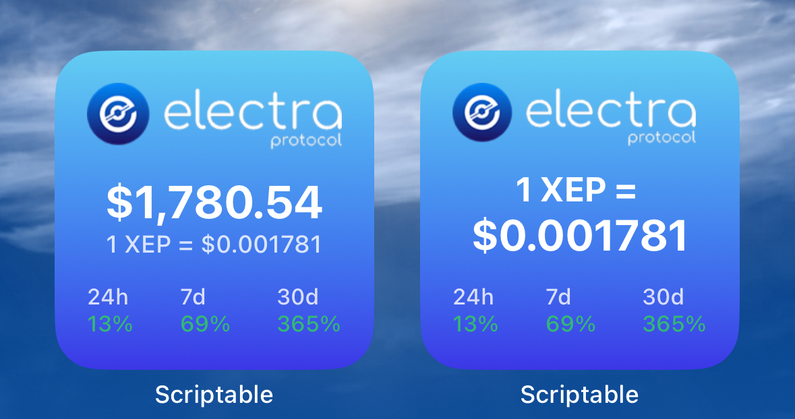
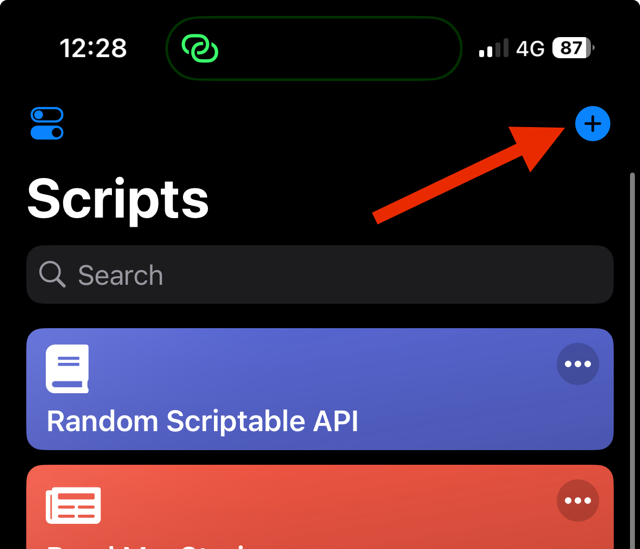
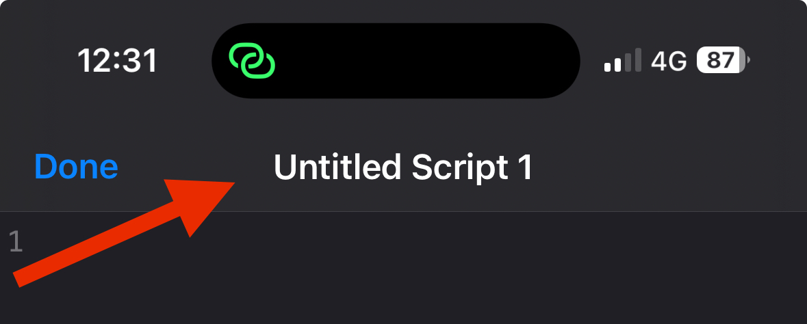
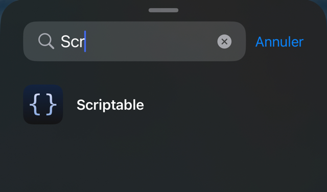
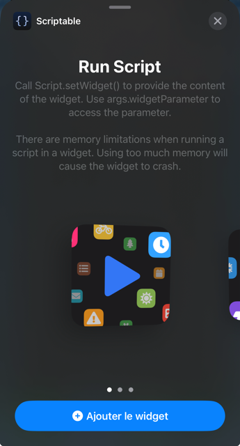
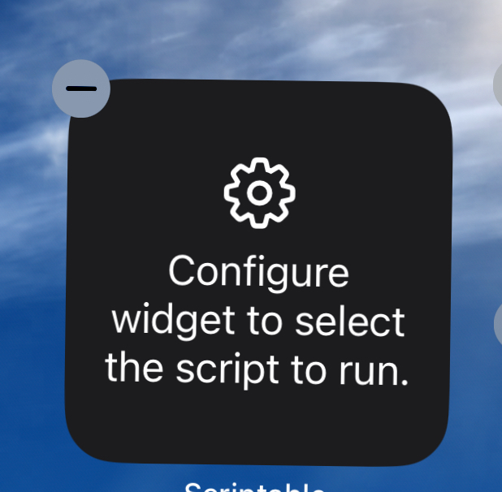
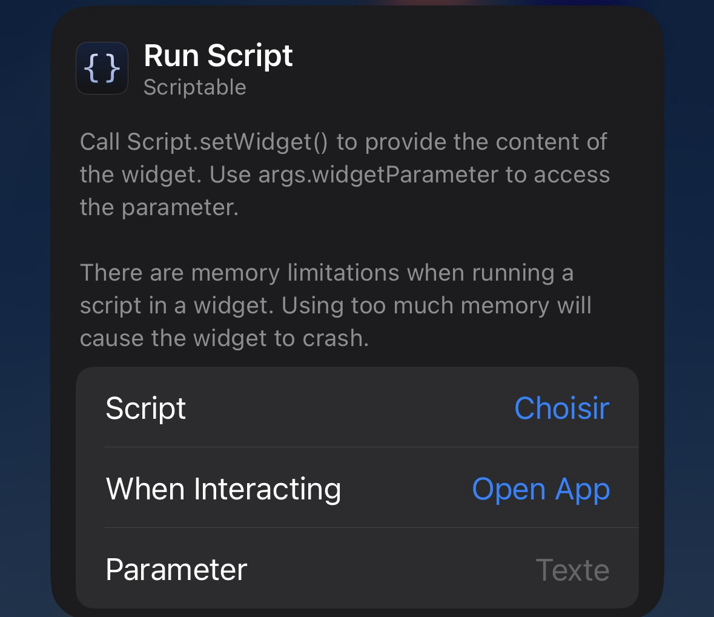
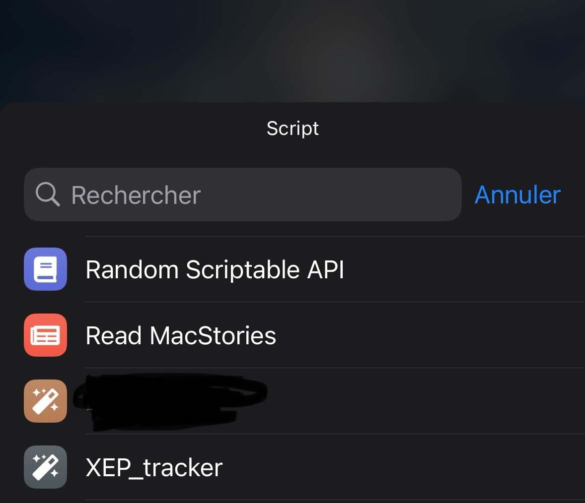

# XEP tracker iOS Widget

Created by DevCaribou\
Powered by [CoinGecko](https://www.coingecko.com) and Scriptable



Left: with 'show_balance = true' ||
Right: with 'show_balance = false'

1. Install the app "Scriptable" [Appsore link](https://apps.apple.com/fr/app/scriptable/id1405459188?l=en)
2. Open the app, then click on the '+' button on the top right corner



3. Past the content of the following script

```js
// XEP iOS Widget
// Powered by CoinGecko and Scriptable
// Made by CaribouXEP
// Licence MIT

// START CUSTOM AREA
// Here are the two values you can update if you want to display your balance in usd instead of just the XEP price
// If you choose to show the balance, the Widget will display you XEP worth in usd as the main value, and the XEP price as a complement.
// If you choose to hide it, the XEP price will be the main display, and your net worth will never appear

// Your XEP balance - only needed if you want to show it
const balance_xep = 1000000.00;
// Show the balance ('true') or hide it ('false')
const show_balance = false;

// END CUSTOM AREA
// You should not update anything below that point unless you know what you're doing

// Coingecko api call for electra protocol market data
const coingecko_api_request_url = "https://api.coingecko.com/api/v3/coins/electra-protocol?localization=false&tickers=false&market_data=true&community_data=false&developer_data=false&sparkline=false";
// Electra protocol icon from the official website downloads
const electra_protocol_icon_url = "https://github.com/DevCaribou/XEP_iOS_Widget/blob/main/images/electra-protocol-logo.png?raw=true";


let request_api = new Request(coingecko_api_request_url);
let coin_data = await request_api.loadJSON();

let request_logo = new Request(electra_protocol_icon_url);
let logo = await request_logo.loadImage();


// Util function with price evolution template
function addPriceEvolutionStack(target_stack, period, evolution){
    const stack_price_change = target_stack.addStack(); 
    stack_price_change.layoutVertically(); 
    stack_price_change.addStack()
    const text_period = stack_price_change.addText(period); 

    stack_price_change.addStack()
    const text_evolution = stack_price_change.addText(`${(evolution).toFixed(0).toString()}%`);
    stack_price_change.addStack()

    text_period.font = Font.mediumSystemFont(11);
    text_period.textOpacity = 0.8;
    text_period.textColor = Color.white();

    text_evolution.font = Font.mediumSystemFont(11);
    text_evolution.textOpacity = 0.8;

    if (evolution >= 0) {
        text_evolution.textColor = Color.green();
    } else {
        text_evolution.textColor = Color.red();
    }
}

// Create the Widget and its content
async function createWidget(current_value, change_24h, change_7d, change_30d)   {
    const balance_value = current_value * balance_xep;

    const widget = new ListWidget();

    // Create gradiant background
    const startColor = new Color("#63CDF2") 
    const endColor = new Color("#3C36E6")
    const gradient = new LinearGradient() 
    gradient.colors = [startColor, endColor] 
    gradient.locations = [0.0, 1]
    widget.backgroundGradient = gradient

    // Create content layout
    const stack_layout = widget.addStack();
    stack_layout.layoutVertically();

    // Logo stack
    const stack_logo = stack_layout.addStack();
    stack_logo.addImage(logo).centerAlignImage();
    stack_layout.addSpacer();

    // Price/Balance stack
    if(show_balance) {
        // Total balance stack
        const stack_balance = stack_layout.addStack();
        stack_balance.addSpacer();
        const text_balance = stack_balance.addText(`$${balance_value.toFixed(2).toString().replace(/\B(?=(\d{3})+(?!\d))/g, ',')}`);
        text_balance.font = Font.boldSystemFont(80);
        text_balance.minimumScaleFactor = 0.1;
        stack_balance.addSpacer();

        // XEP price stack
        const stack_price = stack_layout.addStack();
        stack_price.addSpacer();
        const text_price = stack_price.addText(`1 XEP = $${current_value.toFixed(6).toString()}`);
        text_price.font = Font.mediumSystemFont(12);
        text_price.textOpacity = 0.8;
        stack_price.addSpacer();
    }
    else {
        // XEP title
        const stack_title = stack_layout.addStack();
        stack_title.addSpacer();
        const text_title = stack_title.addText("1 XEP = ");
        text_title.font = Font.boldSystemFont(17);
        text_title.minimumScaleFactor = 0.1;
        stack_title.addSpacer();

        // XEP Price
        const stack_price = stack_layout.addStack();
        stack_price.addSpacer();
        const text_price = stack_price.addText(`$${current_value.toFixed(6).toString()}`);
        text_price.font = Font.boldSystemFont(80);
        text_price.minimumScaleFactor = 0.1;
        stack_price.addSpacer();

    }

    stack_layout.addSpacer();

    // Price evolution stack
    const stack_evolution = stack_layout.addStack();
    addPriceEvolutionStack(stack_evolution, "24h", change_24h);
    stack_evolution.addSpacer();
    addPriceEvolutionStack(stack_evolution, "7d", change_7d);
    stack_evolution.addSpacer();
    addPriceEvolutionStack(stack_evolution, "30d", change_30d);

    return widget;
}

const widget = await createWidget(coin_data['market_data']['current_price'].usd, coin_data['market_data']['price_change_percentage_24h'], coin_data['market_data']['price_change_percentage_7d'], coin_data['market_data']['price_change_percentage_30d']);

if (config.runsInWidget) {
  Script.setWidget(widget);
} else {
  widget.presentSmall();
}

Script.complete();
```

4. If you want to show your balance, edit 'balance_xep' and 'show_balance' to your liking
5. Rename the script (click on the 'Untitled Sctipt 1' label on the top of the screen)



6. Tap 'done'
7. Go to your homescreen, press and hold to make the icons shake.
8. Tap the '+' button on the top left corner
9. Find 'Scriptable' in the list (Scroll down or use the search bar)



10. Select the small size (the first one, should be selected by default)



11. Tap 'Add Widget' and move the new widget where you want it
12. Long tap on the Widget, select the script you just created and you're done






    
